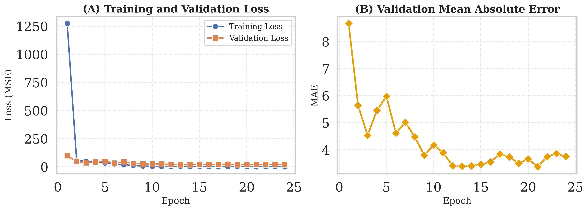
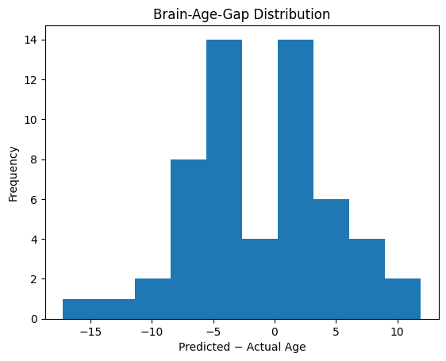
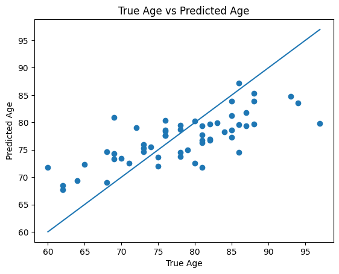
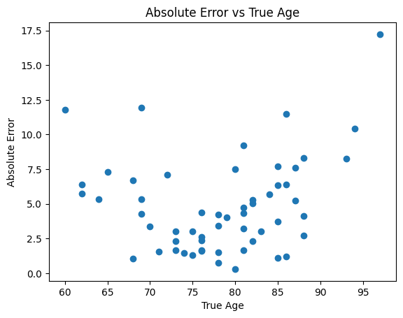

# Brain-Age Gap Prediction using 3D RESNET
This project implements a brain age prediction model using 3D MRI volumes and a 3D ResNet architecture.  
The goal is to estimate a subject’s brain age from T1-weighted MRI scans and compute the Brain-Age Gap (BAG), defined as:  
- Brain-Age Gap = Predicted Age − Chronological Age  

A positive BAG indicates accelerated brain aging, while a negative BAG may indicate a younger-appearing brain.

**Data Details**
Data was obtained from [OASIS-2](https://sites.wustl.edu/oasisbrains/home/oasis-2/)  
This set of MR images was from a longitudinal collection of 150 subjects aged 60 to 96. For each subject, 3 or 4 individual T1-weighted MRI scans were obtained in single scan sessions.
72 of the subjects were characterized as nondemented throughout the study.  
64 of the included subjects were characterized as demented at the time of their initial visits and remained so for subsequent scans, including 51 individuals with mild to moderate Alzheimer’s disease.  
Another 14 subjects were characterized as nondemented at the time of their initial visit and were subsequently characterized as demented at a later visit.

# Project Overview
Input data: T1-weighted MRI scans (.nii or preprocessed 3D tensors)  
*Obtain data from above link* Preprocess data per participant  
data_build.py and data_split.py files prepare the data for training  

Model: Custom 3D ResNet-18 architecture  
Model details available at model.resnet.py  
A basic block, resnet layer, then combining the two  
An additional MRI_AgeModel to add diagnosis  

Model training on Modal, H100 GPUs  

Output: Continuous age prediction  
Evaluation Metrics:  
- Mean Absolute Error (MAE)  
- Root Mean Squared Error (RMSE)
- Correlation between True Age and Predicted Age
- Brain-Age Gap distribution

